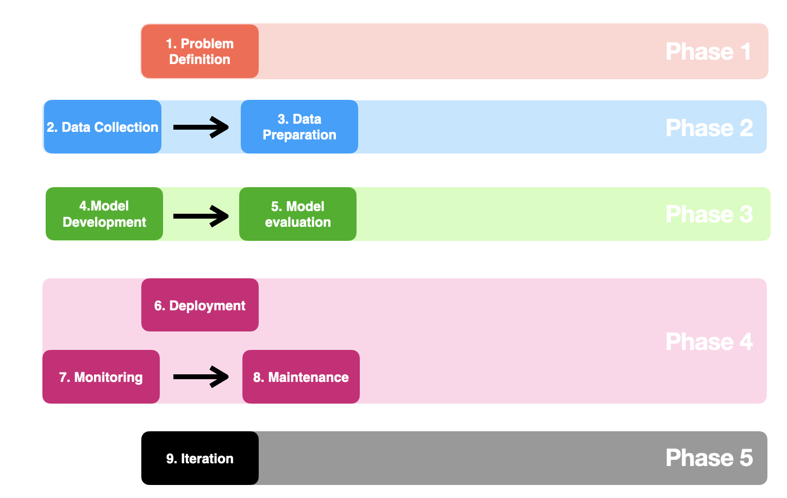

# ML-OPS Pipeline – Custom Neural Network Deployment & Automation



---

## Overview

This project showcases a **complete MLOps pipeline** focused on deploying a custom-built neural network using **Docker**, **AWS EKS**, and **GitHub Actions**. The goal is to automate model deployment, monitoring, and version control while ensuring scalability and maintainability in a real-world infrastructure environment.

---

## Project Phases

1. **Problem Definition** – Define the task and success metrics for the neural network.
2. **Data Collection & Preparation** – Gather data and preprocess it for training.
3. **Model Development & Evaluation** – Train and evaluate a feedforward neural network built from scratch in Python/NumPy.
4. **Deployment, Monitoring & Maintenance** – Containerize and deploy the model to AWS EKS, with automated CI/CD pipelines and live monitoring.
5. **Iteration** – Continuously improve based on performance metrics and feedback loops.

---

## Technologies Used

- **Cloud & DevOps**: AWS (EKS, EC2, IAM, S3), Terraform, Docker, Kubernetes, GitHub Actions
- **Monitoring**: Prometheus, Grafana
- **ML Tooling**: Python, NumPy, MLflow (planned), DVC (planned)

---

## Current Status

- [x] Custom neural network built and evaluated (Python/NumPy)
- [ ] Docker containerization of the trained model
- [ ] AWS EKS deployment with Terraform
- [ ] CI/CD pipeline integration (GitHub Actions)
- [ ] Monitoring setup with Prometheus/Grafana
- [ ] DVC for data versioning and MLflow for experiment tracking

---

## Diagram

The diagram above outlines the **MLOps lifecycle phases** covered in this project.

---

## How to Use

1. Clone the repository:
   ```bash
   git clone https://github.com/SysCd/ML-OPS.git
   cd ML-OPS
